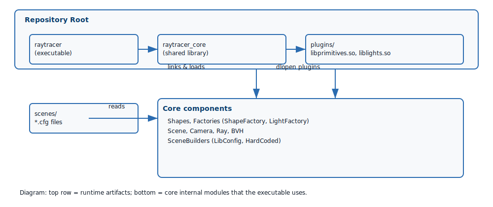
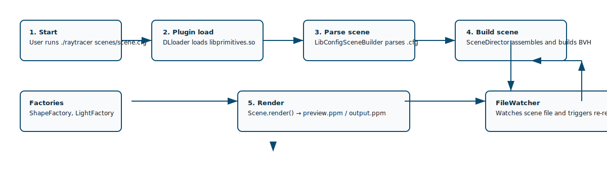

# Architecture

This page contains two diagrams that explain the structure and runtime flow of the project.

## Component Diagram

The high-level components and their relationships:
The SVG image below visualizes the same component layout.

## Startup / Render Flow

Sequence of actions when `./raytracer scenes/scene.cfg` is run:

The flow diagram below shows the runtime sequence from startup to rendering.

These diagrams map directly to the code in `src/main.cpp`, `src/Raytracer/SceneBuilding/LibConfigSceneBuilder.cpp`, `src/Factory/*`, and `src/Shapes/*`.
